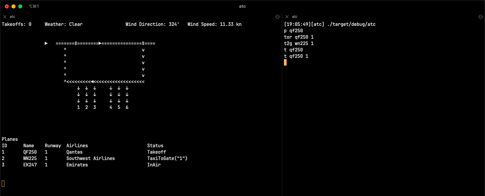

<p align="center">
  
</p>

# Roger

Roger is an ATC simulator written in Rust.
Generally, ATC simulators simulate ground-based traffic or radar-based traffic.
This simulator focuses on ground-based traffic.
You can direct the traffic to the gates and prepare them for takeoff.

Real-world scenarios, like inclement weather, emergencies, and runway incursions, are planned to be added to make it more realistic.

# How to Run?

Clone this repo and then build the binary using:

```
cargo build
```

Then, split your terminal into two vertical panes. On either one of them, run the command console as:

```
./target/debug/atc
```

This is used to enter the ATC commands.

On the next pane, run the simulator window using the command:

```
./target/debug/atc --sim
```

This displays the airport map and the relevant dashboards.

# Peek at the Simulator



# Commands

| Command                          | Action                 |
| -------------------------------- | ---------------------- |
| `l <aircraft> <runway_number>`   | Landing at runway X    |
| `t <aircraft> <runway_number>`   | Takeoff from runway X  |
| `hp <aircraft>`                  | Hold position          |
| `p <aircraft>`                   | Pushback               |
| `tor <aircraft> <runway_number>` | Taxi onto runway X     |
| `hs <aircraft> <runway_number>`  | Hold short of runway X |
| `t2g <aircraft> <gate_number>`   | Taxi to gate X         |

# License

This simulator is licensed under the [GNU General Public License v3.0](https://github.com/pncnmnp/roger/blob/master/LICENSE).
